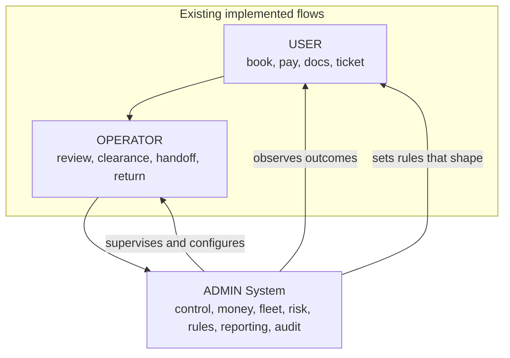

# 02 — Actors & Responsibilities

**Scope:** Defines who uses the Admin System and the hard boundary between USER, OPERATOR, and ADMIN.
**Read after:** `01_PRODUCT_UX_VISION.md`.

---

## 1. Why this document matters

The single biggest risk to this product is the Admin becoming a bloated copy of the operator console. This document fixes the responsibility boundary so that every module spec (`06`) can reference it, and so the build team never re-implements operator execution inside Admin.

## 2. The three actors

```txt
USER      = the customer. Self-service journey.
OPERATOR  = airport staff. Executes one reservation case at a time.
ADMIN     = business control. Supervises and configures across all cases.
```

### 2.1 USER (existing, not built here)

The customer's surface. Already implemented. Out of scope for the Admin build, but the Admin must be able to **see the result** of what the user did.

| The user does | The admin needs to see |
|---|---|
| Browses fleet, books a vehicle | The reservation exists, its source, its details |
| Completes payment verification | Payment status, deposit/authorization status |
| Uploads identity documents | Document status (pending / approved / rejected + reason) |
| Waits in the waiting room | Where the reservation is stuck and why |
| Receives a smart ticket | Whether the case is ready for pickup |
| Cancels an eligible reservation | The cancellation and any financial consequence |
| Views own history/profile | The customer profile and history (admin-side, richer) |

### 2.2 OPERATOR (existing, not built here)

Airport execution staff. Already implemented. The Admin must **supervise** this work, not redo it.

| The operator does (execution) | The admin does NOT do | The admin DOES do (control) |
|---|---|---|
| Works the daily case queue | Work the queue case-by-case as the primary job | See the queue health and where it is stuck |
| Scans the customer ticket / QR | Scan tickets at the desk | Configure ticket/handover rules; audit scans |
| Reviews documents inside a case (approve/reject) | Be the routine document reviewer | Supervise review backlog; override/escalate; audit decisions |
| Records desk balance collection | Stand at the desk collecting money | See all money owed/collected; reconcile; refund |
| Performs the physical handoff checklist | Perform the physical handoff | Define the handover process; review evidence; audit |
| Uses the audited manual fallback | Trigger fallback routinely | Govern when fallback is allowed; review every fallback use |
| Completes the case after return | Close cases as routine work | See completion rates; audit overrides; reconcile charges |

### 2.3 ADMIN (the product specified here)

Business control across the whole operation. The Admin answers the first-principles questions in `01 §3`. It owns: oversight, money control, fleet control, customer/risk, contracts governance, staff & permissions, business rules, reporting, and audit.

## 3. The boundary, stated as rules

These rules are normative. Each module spec restates the relevant one as an "Operator boundary" note.

1. **Supervision over execution.** Admin sees and steers; the operator executes. If a routine, per-case, desk-side action belongs to the operator, Admin shows its status and history but does not become the primary place to perform it.
2. **Intervention is allowed, routine is not.** Admin may intervene on a case (cancel, reassign vehicle, override release, issue refund, force-unblock with reason) — these are **exceptional, audited** actions, not the daily workflow.
3. **Configuration is Admin-only.** Business rules, pricing rules, locations, hours, extras, Financial Policies (including deposits and cancellation), contract terms, notification templates, roles, and permissions are configured in Admin, never in the operator console.
4. **Money truth lives in Admin.** The operator records desk collection; Admin is where the full financial picture (revenue, deposits, balances, refunds, charges, invoices) is controlled and reconciled.
5. **Audit lives in Admin.** Who did what, when, and why is surfaced in Admin (`M-14`), including operator critical actions.
6. **No duplicate queues.** Admin's Reservations module is organized as cases by state for **control**, not as a desk work queue. It must not become a second operator dashboard.

## 4. Decision matrix: where does an action live?

| Action | USER | OPERATOR | ADMIN | Notes |
|---|---|---|---|---|
| Create a booking | Primary | Possible | View / create on behalf (exceptional) | Admin booking-on-behalf is an intervention, P0-optional |
| Verify payment (customer) | Primary | — | View | |
| Approve/reject a document | — | **Primary** | Override / supervise / audit | Routine review stays operator-side |
| Collect desk balance | — | **Primary** | View / reconcile / refund | |
| Physical handoff checklist | — | **Primary** | Configure / review evidence / audit | |
| Manual fallback release | — | Execute (audited) | Govern / review every use | |
| Cancel a reservation | Own pending only | Broader | **Full control + reason + financial handling** | |
| Reassign vehicle on a reservation | — | — | **Admin** | Availability-aware |
| Issue a refund | — | — | **Admin** (PERM-gated) | Always confirmed + reason |
| Block / unblock a vehicle | — | — | **Admin** | With reason |
| Open / resolve an incident | — | Report | **Admin manages lifecycle** (P1) | |
| Change a price / pricing rule | — | — | **Admin** (P1) | Confirmed + preview |
| Create staff / assign role | — | — | **Admin** | |
| Edit business rules / settings | — | — | **Admin** | |
| View reports & analytics | — | — | **Admin** (P1) | |
| View audit log | — | — | **Admin** (P1) | |

## 5. Admin role templates and custom roles

The existing system has a single `ADMIN` role. The proposal defines six business personas. In the Admin blueprint these personas are modeled as **default role templates** (named permission bundles) inside Roles & Permissions (`M-07`), not as six hard-coded limits. Businesses can clone templates into custom roles safely through the configurable access-control system (`22`).

| ID | Default role template | Primary need | Cares most about | Typical landing |
|---|---|---|---|---|
| `RP-1` | Owner / CEO | Whole-business view | Revenue, fleet utilization, critical problems, growth | Command Center → Reports |
| `RP-2` | Operations Manager | Daily operational control | Reservations, pickups, returns, blockers, maintenance | Command Center → Reservations |
| `RP-3` | Branch / Airport Manager | Local execution oversight | Today's cases, ready vehicles, conflicts, operators | Command Center (scoped) |
| `RP-4` | Finance Admin | Money control & traceability | Payments, deposits, invoices, refunds, balances | Payments |
| `RP-5` | Fleet Manager | Asset control | Availability, maintenance, vehicle docs, damages, status | Fleet |
| `RP-6` | Supervisor | Team control & accountability | Permissions, productivity, audit, incidents | Audit / Roles |

### 5.1 UX principle per role template

Not all profiles see the same depth of information.

- Owner needs **strategic** visibility.
- Manager needs **daily control**.
- Finance needs **traceability**.
- Fleet needs **physical state and availability**.
- Supervisor needs **risk and accountability**.

Therefore the UX must support: a global view, role-filtered views, fast actions, noise reduction, and trust in critical data. This is realized through permission-aware rendering (`11`), not separate apps.

### 5.2 P0 access-control stance

P0 ships with default templates (Owner/Admin, Operations, Finance, Fleet, Supervisor) that map onto the capability list in `M-07`. The business may create custom roles by cloning templates, but cannot self-escalate, remove last-owner access, or grant dangerous capabilities without the governed preview/approval/audit flow in `22` and `23`.

## 6. Capability domains (preview of M-07)

Permissions are expressed in **business language**, not technical scopes. Full capability list, default template grants, and custom-role constraints are in `11` and `22`. Domains:

```txt
Reservations    → view, modify, cancel, reassign, force-unblock
Documents       → view, override approve/reject, escalate
Money           → view financials, record adjustments, refund, manage invoices
Fleet           → view, edit vehicles, block/unblock, manage vehicle docs
Handover        → configure process, view evidence
Customers       → view, edit, flag risk, add internal notes
Maintenance     → open/close incidents, schedule maintenance (P1)
Pricing         → change prices / rules (P1)
Staff           → manage staff, assign roles
Settings        → edit business rules
Reports         → view analytics (P1)
Audit           → view audit logs (P1)
```

## 7. Actor relationship diagram



## 8. Boundary acceptance criteria

The Admin build satisfies the boundary when:

- Every module spec contains an explicit "Operator boundary" note.
- No Admin screen reproduces the operator's per-case desk queue as its primary mode.
- All Admin interventions on a case (cancel, reassign, override, refund, force-unblock) are confirmed and capture a reason, and are expected to be auditable.
- Configuration surfaces (Settings, Pricing, Roles, Notifications, Handover process) exist only in Admin.
- The full financial picture is controllable from Admin, while desk collection remains an operator action that Admin observes.
- Permission profiles change what is visible and actionable without requiring separate apps.
