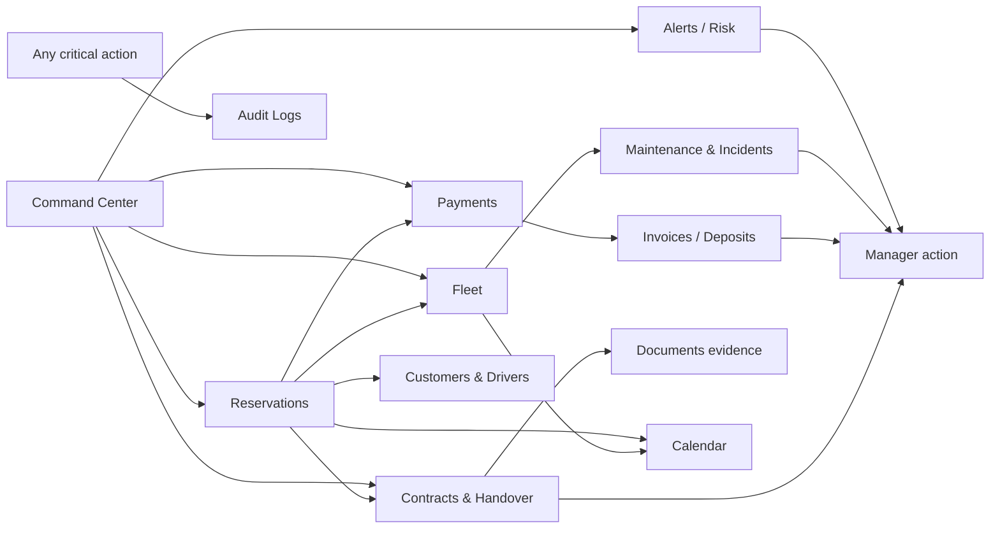

# 03 — Information Architecture

**Scope:** Navigation model, route map, global shell, grouping logic. UX-level only (no technical routing decisions).
**Read after:** `02_ACTORS_AND_RESPONSIBILITIES.md`.

---

## 1. IA principles

1. **Group by business task, not by database entity.** Navigation reads as the jobs a manager does, not as tables.
2. **Command Center is home.** The default landing is the operational control screen, and most flows can start there.
3. **Depth over breadth.** A shallow set of top-level destinations, each with rich detail views where decisions happen.
4. **Detail is where decisions live.** Lists route to case/detail views; the list alone is never the end of a task.
5. **Permission-aware, not permission-fragmented.** One IA for all role templates and custom roles; visibility adapts (see `11`, `22`).

Good grouping:

```txt
Reservations · Fleet · Payments · Contracts & Handover · Maintenance · Reports
```

Weak grouping (forbidden):

```txt
Tables · Records · Objects · Documents
```

## 2. Route map (UX IA target)

The proposal positions Admin as a standalone control layer. The IA target is a top-level `/admin` space. (The existing code currently nests admin under `/operator/admin/*`; that is an implementation detail, noted here only for awareness. Routes below are UX information architecture, not a technical routing mandate.)

| Route (UX) | Screen ID | Module | Level |
|---|---|---|---|
| `/admin` | `SCR-010` | Command Center | P0 |
| `/admin/reservations` | `SCR-020` | Reservations (list-by-state) | P0 |
| `/admin/reservations/[id]` | `SCR-021` | Reservation case detail | P0 |
| `/admin/fleet` | `SCR-030` | Fleet list | P0 |
| `/admin/fleet/[id]` | `SCR-031` | Vehicle detail | P0 |
| `/admin/customers` | `SCR-040` | Customers & drivers list | P0 |
| `/admin/customers/[id]` | `SCR-041` | Customer profile | P0 |
| `/admin/payments` | `SCR-050` | Payments & money control | P0 |
| `/admin/payments/[id]` | `SCR-051` | Payment / transaction detail | P0 |
| `/admin/invoices` | `SCR-052` | Invoices & receipts | P0 |
| `/admin/handover` | `SCR-060` | Contracts & handover list | P0 |
| `/admin/handover/[id]` | `SCR-061` | Handover record detail | P0 |
| `/admin/staff` | `SCR-070` | Staff list | P0 |
| `/admin/staff/[id]` | `SCR-071` | Staff member detail | P0 |
| `/admin/roles` | `SCR-072` | Roles & permissions | P0 |
| `/admin/settings` | `SCR-080` | Settings hub | P0 |
| `/admin/settings/[section]` | `SCR-081` | Settings section detail | P0 |
| `/admin/settings/financial-policies` | `SCR-082` | Financial policy configuration | P0 |
| `/admin/maintenance` | `SCR-090` | Maintenance & incidents | P1 |
| `/admin/maintenance/[id]` | `SCR-091` | Incident / maintenance detail | P1 |
| `/admin/calendar` | `SCR-100` | Calendar / occupancy | P1 |
| `/admin/pricing` | `SCR-110` | Pricing rules | P1 |
| `/admin/notifications` | `SCR-120` | Notifications & templates | P1 |
| `/admin/reports` | `SCR-130` | Reports & analytics | P1 |
| `/admin/audit` | `SCR-140` | Audit logs | P1 |
| `/admin/search` | `SCR-150` | Global search results | P0 |
| `/admin/me` | `SCR-160` | Admin profile & preferences | P0 |

Cross-cutting screen patterns (`SCR-9xx`) such as Forbidden, Not-found, and Global-error are defined in `08`/`10`.

## 3. Primary navigation

The left/primary navigation is grouped by business task. The order reflects daily frequency and value.

```txt
CONTROL
  Command Center                /admin
  Reservations                  /admin/reservations
  Calendar                      /admin/calendar            (P1)

ASSETS & PEOPLE
  Fleet                         /admin/fleet
  Maintenance & Incidents       /admin/maintenance         (P1)
  Customers & Drivers           /admin/customers

MONEY & DOCUMENTS
  Payments                      /admin/payments
  Invoices                      /admin/invoices
  Contracts & Handover          /admin/handover

GROWTH
  Reports & Analytics           /admin/reports             (P1)
  Pricing Rules                 /admin/pricing             (P1)

GOVERNANCE
  Staff & Roles                 /admin/staff
  Settings / Business Rules     /admin/settings
    Financial Policies          /admin/settings/financial-policies
  Notifications                 /admin/notifications        (P1)
  Audit Logs                    /admin/audit                (P1)
```

P1 items are present in the IA but hidden/disabled until built and until the relevant capability is granted (see `11`). Group headers are quiet labels, not interactive.

## 4. Secondary / global navigation (the app shell)

Persistent across all screens. Detailed component behavior in `12` (`CMP` IDs) and states in `10`.

| Shell element | Purpose | Notes |
|---|---|---|
| Global search (`CMP-001`) | Jump to any reservation, vehicle, customer, invoice, staff | Keyboard-openable; results route to `SCR-150` or directly to detail |
| Today / date context | Anchors the operational "today"; date scope where relevant | Command Center and Calendar are date-aware |
| Critical alert indicator (`CMP-014`) | Surfaces count of items needing action | Click opens the Command Center alerts region |
| Create menu | Quick create: reservation (on behalf), vehicle, staff, incident | Permission-gated entries |
| Role/profile context | Shows current admin identity and active role template or custom role | |
| Account menu | Profile (`/admin/me`), preferences, sign out | |
| Breadcrumbs | Orientation in detail/sub-section screens | List → detail → sub-tab |

### 4.1 Layout structure (all screens)

```txt
┌────────────────────────────────────────────────────────┐
│ Top bar: search · today · alerts · create · account     │
├───────────────┬────────────────────────────────────────┤
│ Primary nav   │ Screen header (title, context, actions) │
│ (grouped by   ├────────────────────────────────────────┤
│  business     │ Screen body                              │
│  task)        │  - filters / segments (where relevant)   │
│               │  - content (states/list/detail)          │
│               │                                          │
│               │ Drawers / modals overlay this region     │
└───────────────┴────────────────────────────────────────┘
```

## 5. Navigation between modules (relationship map)

The modules are not silos; they link through the reservation case, the vehicle, the customer, and money.



### 5.1 Canonical cross-links

| From | To | Trigger |
|---|---|---|
| Command Center blocker card | Reservation case detail (`SCR-021`) | Click a blocked reservation |
| Reservation case | Customer profile (`SCR-041`) | Click customer |
| Reservation case | Vehicle detail (`SCR-031`) | Click vehicle |
| Reservation case | Payment detail (`SCR-051`) | Click money section |
| Reservation case | Handover record (`SCR-061`) | Click contract/handover section |
| Vehicle detail | Maintenance/incident (`SCR-091`) | Click open incident (P1) |
| Vehicle detail | Calendar filtered to vehicle (`SCR-100`) | "View occupancy" (P1) |
| Any critical action | Audit entry (`SCR-140`) | "View history" (P1) |
| Payment detail | Invoice (`SCR-052`) | "View invoice" |
| Reservation case money blocker | Financial Policies (`SCR-082`) | "View policy" for admins with configuration rights |
| Roles screen | Access-control governance (`SCR-072`) | "View version history" / "View as role" |

Every detail screen offers a "back to source list" path and breadcrumb.

## 6. Entry-point model

Most work starts at the Command Center, but each module is independently reachable.

| Entry point | Lands on | Typical role |
|---|---|---|
| App open / home | Command Center (`SCR-010`) | All |
| Primary nav item | Module list root | All |
| Global search | `SCR-150` or detail | All |
| Critical alert indicator | Command Center alerts region | RP-2, RP-3 |
| Deep link to a case | Reservation case (`SCR-021`) | All (permission-checked) |
| Create menu | Relevant create modal/screen | Permission-gated |

## 7. State-organized navigation inside modules

Within Reservations (and conceptually Fleet, Payments), work is segmented by **state**, not by raw date. Reservation segments (canonical, from the existing flow + proposal):

```txt
Today pickup · Today return · Blocked · Payment pending · Document pending ·
Ready for pickup · Active rentals · Upcoming · Completed · Cancelled / no-show
```

These segments are the same vocabulary used across the Command Center, Reservations list, and the state matrix (`10`). They are not a generic filter dump; they are prioritized work groups (see `M-02`).

## 8. Responsive IA

| Breakpoint intent | Navigation behavior |
|---|---|
| Wide (desktop, primary target) | Persistent primary nav + full detail layouts; tables/cards side by side. |
| Medium (small laptop / large tablet) | Primary nav collapsible to icons; detail screens stack secondary panels. |
| Narrow (tablet / phone, secondary) | Primary nav becomes a drawer; lists become stacked cards; detail screens become single-column with tabbed sections; drawers become full-screen sheets. |

The Admin is a **desktop-first operational product**; narrow support is for on-the-go checks (a manager glancing at blockers), not full data entry. Heavy configuration screens (Settings, Pricing, Roles) are desktop-first and may present a simplified read-mostly view on narrow screens.

## 9. IA acceptance criteria

- Navigation labels are business tasks, never entity/table names.
- Command Center is the default landing and links to every other module's critical items.
- Every list screen routes to a detail screen where decisions happen.
- Every detail screen has breadcrumbs and a back-to-list path.
- P1 destinations are present in the IA but gated until built and permitted.
- Cross-links in §5.1 are all reachable.
- The same IA serves all role templates and custom roles; only visibility/affordances change (`11`, `22`).
- Financial Policies are discoverable from Settings and relevant money/release-gate explanations, but configuration remains Admin-only and governed (`21`, `23`).
- Reservation state segments use the canonical vocabulary in §7 everywhere.
