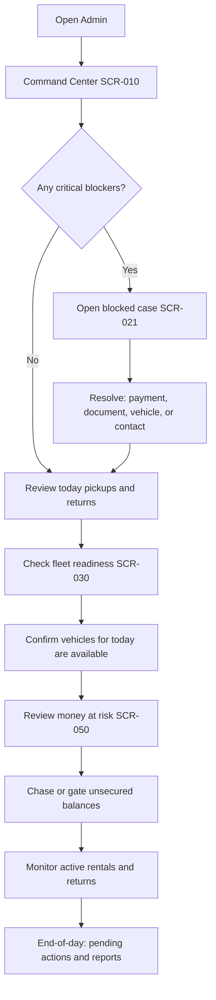
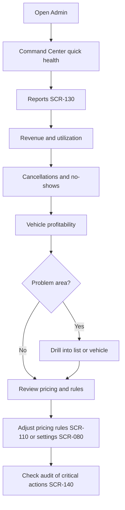
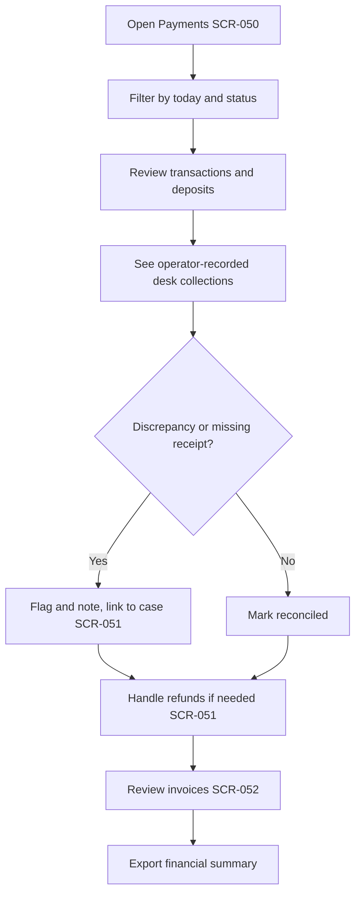
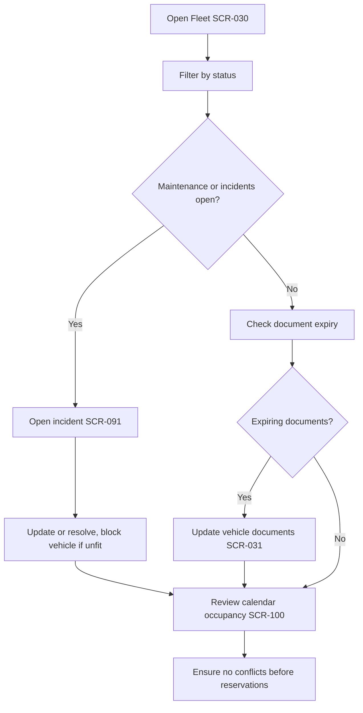
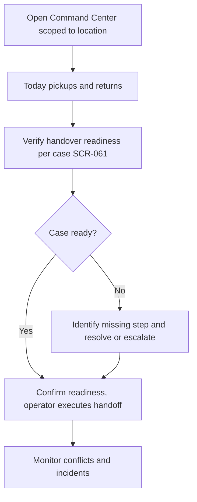
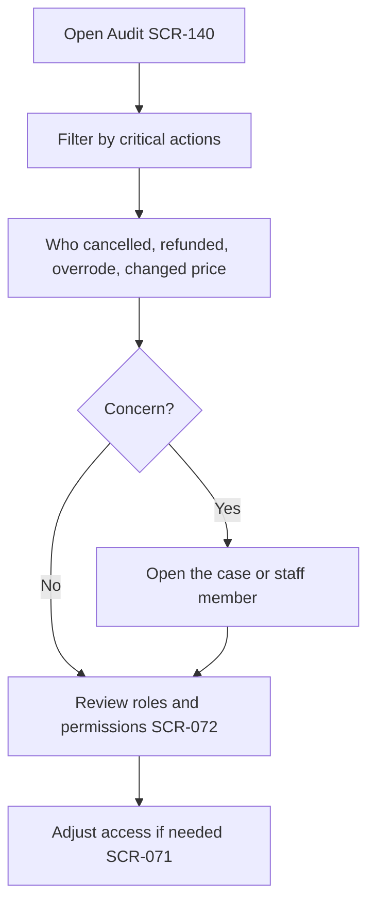
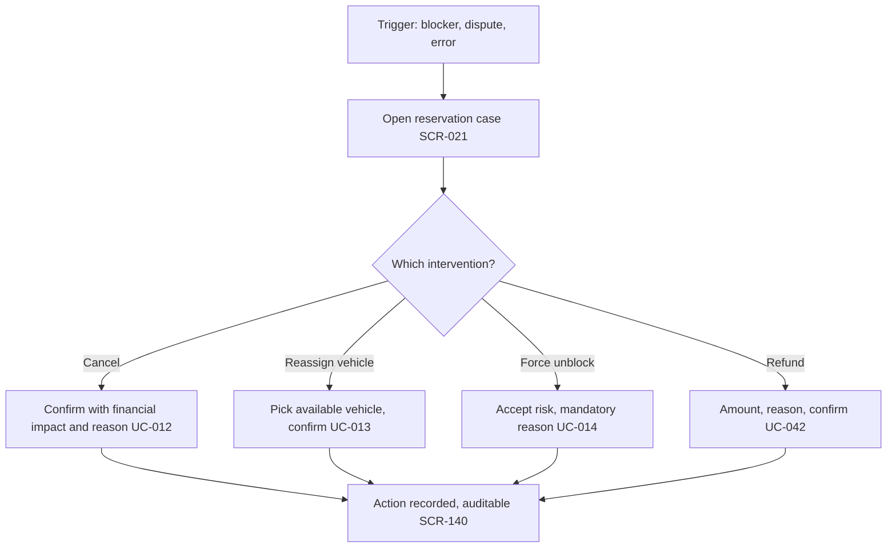
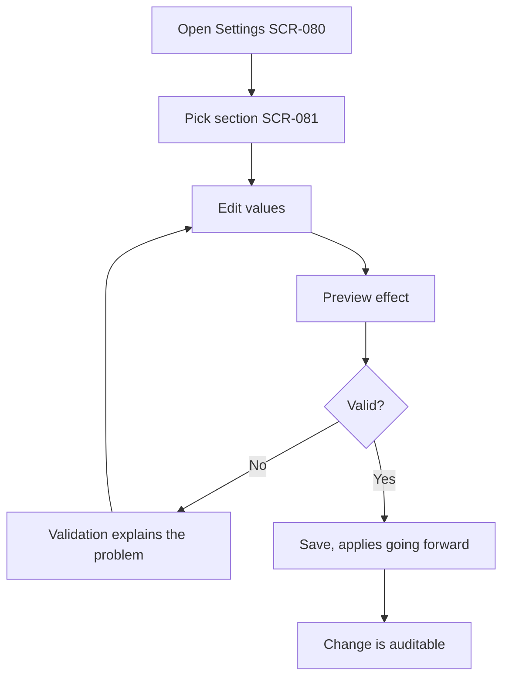

# 05 — Admin Journey Maps

**Scope:** How real admins move through the product across a day and by default role template or custom role.
**Read after:** `04_USE_CASE_CATALOG.md`. References screens (`08`) and use cases (`04`).

---

## 1. Why journeys, not just screens

Screens describe surfaces; journeys describe **intent over time**. These maps ensure the IA (`03`) and screens (`08`) actually support real workflows, and they anchor the demo (`13`). Each journey lists the emotional/decision goal at each step, not just the click.

## 2. Primary journey — Operations Manager's morning (RP-2)

This is the canonical "first 30 seconds + first 30 minutes" journey. It is the product's core promise.

| Step | Goal | Screen | Use case | Success signal |
|---|---|---|---|---|
| Open | "What is my day?" | `SCR-010` | UC-001 | Day shape understood in seconds |
| Blockers | "What will break?" | `SCR-010`→`SCR-021` | UC-002 | Each blocker has a next action |
| Resolve | "Fix it now" | `SCR-021`+sub | UC-002, UC-013, UC-014 | Blocker clears from Command Center |
| Today's flow | "Who arrives/returns?" | `SCR-010`/`SCR-020` | UC-010 | Pickups/returns visible by state |
| Fleet readiness | "Are the cars ready?" | `SCR-030` | UC-020 | No surprise unavailable vehicle |
| Money | "Is money secured?" | `SCR-050` | UC-040 | Unsecured money flagged before release |
| Monitor | "Anything new?" | `SCR-010` | UC-003 | Alerts triaged |
| Close | "What is left?" | `SCR-130`/`SCR-010` | UC-120 | Outstanding items known |

## 3. Owner / CEO weekly review (RP-1)

Owner cares about strategy: is the business healthy, where is money made/lost, are controls respected. Owner rarely touches individual cases but must be able to drill from any metric to its source (UC-120) and confirm accountability (UC-130).

## 4. Finance Admin daily close (RP-4)

Finance cares about traceability: every euro links to a reservation, desk collections are visible, refunds and charges are controlled and audited (UC-041..UC-044).

## 5. Fleet Manager journey (RP-5)

Fleet cares about physical state and availability: which cars are fit, which are blocked and why, what is coming due (UC-020..UC-024, UC-080, UC-081, UC-090).

## 6. Branch / Airport Manager journey (RP-3)

Branch/Airport manager cares about local execution oversight: today's cases ready, conflicts caught, operators supported — without doing the operator's desk job (UC-050, boundary in `02`).

## 7. Supervisor journey (RP-6)

Supervisor cares about accountability and access hygiene (UC-061, UC-130).

## 8. Critical intervention journey (cross-role)

The exceptional, audited path that must feel deliberate, not casual.

Every branch ends in an auditable record. None of these are one-click.

## 9. Configuration journey (cross-role, low frequency, high stakes)

Configuration is rare but consequential; always previewable and validated (UC-070, UC-071, UC-052, UC-100, UC-110).

## 10. Journey-derived requirements (feed into screens)

These requirements are extracted from the journeys above and must hold in `06`/`08`:

1. Command Center must surface blockers, today's flow, money-at-risk, and alerts on one screen (RP-2 morning).
2. Every metric in Reports must drill to its source list (RP-1 review).
3. Payments must show operator-recorded desk collections and link every transaction to a reservation (RP-4 close).
4. Fleet must distinguish physical vs commercial status and surface document expiry and maintenance (RP-5).
5. Handover readiness must reflect, not replace, operator execution (RP-3, boundary).
6. Audit must be reachable both globally and in-context (RP-6, interventions).
7. Every critical intervention must be confirmed, reasoned, and audited (intervention journey).
8. Configuration must be sectioned, previewable, validated (configuration journey).

## 11. Emotional design notes

- Morning open should feel **reassuring** when nothing is wrong (calm all-clear), and **clear** when something is (one obvious next action).
- Interventions should feel **deliberate and safe** — the user should feel the system is protecting them from mistakes, not slowing them down arbitrarily.
- Configuration should feel **confident** — preview before commit removes fear.
- Money screens should feel **trustworthy** — explicit breakdowns, no ambiguity.
