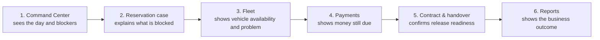

# 13 — Commercial Demo Flow

**Scope:** How to demonstrate and sell the Admin System. A scripted, screen-mapped storyline.
**Read after:** `12_FRONTEND_COMPONENT_INVENTORY.md`. Maps to screens (`08`) and use cases (`04`).

---

## 1. Demo thesis

> The sale is not "we have features." The sale is "we prevent operational chaos and protect your money."

A strong demo does not start with "here are all the menus." It starts with a **business scenario** and shows the product resolving it.

## 2. The scenario

```txt
It is 8:00 AM at Casablanca Mohammed V Airport.
The team has 9 pickups and 4 returns today.
Two reservations are blocked: one by documents, one by an unauthorized deposit.
One vehicle expected for a pickup has an open incident.
One customer still owes a desk balance.
The manager opens the Admin System and sees every blocker immediately.
```

This scenario should be pre-seeded as demo data so every step lands.

## 3. The narrative arc (6 beats)



## 4. Step-by-step script

### Beat 1 — Command Center sees everything (SCR-010)
- **Say:** "Here's everything that can break your operation today — and you can act from here."
- **Show:** Today summary (9 pickups / 4 returns), the two blockers with reasons, money-at-risk total, the vehicle with an open incident, the unpaid desk balance.
- **Land:** In one screen, the manager already knows the day. No WhatsApp, no Excel, no calling the desk.
- **Use cases:** UC-001, UC-003. **Components:** CMP-008 BlockerCallout, CMP-009 MoneyBreakdown, CMP-014 AlertList.

### Beat 2 — The blocked reservation explains itself (SCR-021)
- **Say:** "Your team no longer works with loose reservations — they work with clear, prioritized cases."
- **Show:** Click the document-blocked case. The blocking reason is inline. The whole case (customer, vehicle, timing, documents, money, readiness, timeline) is on one screen. Resolve or escalate.
- **Land:** The case tells you exactly what is missing and what to do.
- **Use cases:** UC-002, UC-011. **Components:** CMP-011 ReadinessChecklist, CMP-013 Timeline.

### Beat 3 — Fleet shows the asset truth (SCR-030 → SCR-031)
- **Say:** "Each car stops being a row in a list and becomes a controlled asset."
- **Show:** The vehicle for the second blocked pickup has an open incident and is therefore not truly available. Demonstrate reassigning to an available compatible vehicle (no double-booking).
- **Land:** The system prevents handing over a problem car and prevents conflicts.
- **Use cases:** UC-020, UC-021, UC-013. **Components:** CMP-021 VehicleCard, CMP-008.

### Beat 4 — Payments protect the money (SCR-050 → SCR-051)
- **Say:** "Your team knows exactly what's collected, what's missing, and what must not be released yet."
- **Show:** The unpaid desk balance and the unauthorized deposit, each as explicit money components — not "paid/unpaid." The release should be gated until money is secured.
- **Land:** No vehicle leaves with unsecured money. This is where rental businesses quietly lose money.
- **Use cases:** UC-040, UC-041. **Components:** CMP-009 MoneyBreakdown, CMP-023 TransactionRow.

### Beat 5 — Contract & handover make it defensible (SCR-061)
- **Say:** "Every delivery and return is documented, signed, and protected."
- **Show:** A handover record: contract + signature, out vs in photos, mileage/fuel, pre-existing vs new damage. Show how new damage becomes a justified charge.
- **Land:** Disputes become winnable; damage costs stop being absorbed.
- **Use cases:** UC-050, UC-051, UC-043. **Components:** CMP-027 EvidenceViewer, CMP-011.

### Beat 6 — Reports turn it into decisions (SCR-130, P1)
- **Say:** "It doesn't just digitize your business — it helps you run it better."
- **Show:** Revenue, fleet utilization, vehicle profitability, cancellations — each drilling into the underlying list.
- **Land:** The owner sees what works and what loses money.
- **Use cases:** UC-120. **Components:** CMP-030 ReportPanel, CMP-012 MetricStat.

## 5. Trust closer (optional, high-impact)

End on control and trust:
- **Audit (SCR-140, P1):** "Every critical action — cancellations, refunds, overrides, price changes — is recorded: who, when, and why."
- **Roles (SCR-072):** "You can delegate work to your team without losing control of your business."
- **Use cases:** UC-130, UC-063.

## 6. Demo do's and don'ts

| Do | Don't |
|---|---|
| Start from the 8 AM scenario | Start with a menu tour |
| Show blockers resolving | Show empty CRUD forms |
| Emphasize money protection and handover evidence | Emphasize vanity metrics |
| Let each screen answer "what do I do now?" | Linger on settings/config early |
| Keep it to the 6 beats (+ trust closer) | Try to show every screen |
| Use pre-seeded realistic data | Use lorem-ipsum / empty states |

## 7. Differentiation talking points (tie to `01 §9`)

1. Control every rental from booking to return.
2. Protect your fleet and your money (deposits, balances, damages, contracts, photos, audit).
3. Airport-ready operations (terminal pickup, smart ticket, fast readiness).
4. Replace WhatsApp, Excel, and paper.
5. Premium operations → premium customer experience.

## 8. Packaging mapped to the demo

| Package | Includes | Demo beats | Sales message |
|---|---|---|---|
| Core Operations (P0) | M-01..M-08 | Beats 1–5 + trust closer (roles/handover) | "Run your rental operation from one professional control center." |
| Professional Operations (P0+P1) | + M-09..M-14 | + Beat 6 (Reports) + Audit closer + Calendar/Maintenance asides | "Optimize operations, reduce risk, and manage the business with data." |
| Intelligent / Enterprise (future P2) | reserved | not demoed as built | "Automate decisions and scale across branches." (roadmap only) |

## 9. Demo data checklist (pre-seed)

- 9 pickups, 4 returns scheduled for "today."
- 1 reservation blocked by a rejected document (with reason).
- 1 reservation blocked by an unauthorized deposit.
- 1 vehicle with an open incident that is expected for a pickup.
- 1 available compatible vehicle to demonstrate reassignment.
- 1 customer with an outstanding desk balance.
- 1 completed handover with out/in photos and one new-damage example.
- Enough historical reservations/revenue for Reports to show real numbers (avoid `ST-016`).
- A second staff member to show roles/permissions.

## 10. Demo acceptance criteria

- The demo can be run end-to-end on seeded data without hitting an empty/error state unintentionally.
- Each beat answers "what do I do now?" on screen.
- Money is shown as explicit components, never "paid/unpaid."
- The blocked-case beat shows the reason inline and a resolution path.
- The handover beat shows out vs in evidence and a justified charge.
- Reports drill from a metric into its source.
