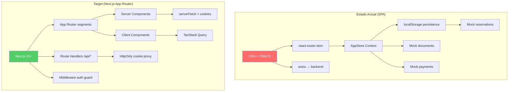

# Auditoría Profunda del Frontend — Casablanca-V1

> **Fecha**: 9 de junio, 2026  
> **Alcance**: `docs/frontend/` (13 documentos + 5 ADRs) + `src/` (SPA actual)  
> **Objetivo**: Crear la mejor interfaz de alquiler de coches de aeropuerto en 2026  

---

## Tabla de contenidos

- [Resumen ejecutivo](#resumen-ejecutivo)
- [Capa 1 — Visual y de Componentes (Shadcn/ui + Tailwind CSS)](#capa-1--visual-y-de-componentes)
- [Capa 2 — Estructura y Reglas Legales (WCAG 2.1/2.2 AA)](#capa-2--estructura-y-reglas-legales)
- [Capa 3 — Rendimiento y Velocidad (web.dev + Vercel/Next.js)](#capa-3--rendimiento-y-velocidad)
- [Capa 4 — Psicología UX (Laws of UX)](#capa-4--psicología-ux)
- [Brecha Arquitectural: SPA actual vs. Next.js App Router](#brecha-arquitectural)
- [Matriz de Hallazgos Consolidada](#matriz-de-hallazgos)
- [Plan de Acción Priorizado](#plan-de-acción-priorizado)

---

## Resumen ejecutivo

El proyecto tiene **una base visual sólida** y documentación técnica excepcionalmente detallada (13 docs de frontend + 5 ADRs). Sin embargo, existe una **brecha crítica** entre lo documentado y lo implementado: la SPA actual (`react-router-dom` + CRACO + `AppStore` con mocks) contradice directamente las decisiones de arquitectura ya tomadas (Next.js App Router, backend como fuente de verdad).

### Diagnóstico por capa

| Capa | Estado | Score | Veredicto |
|---|---|---|---|
| 🎨 Visual y Componentes | Sólida con gaps | **7.2/10** | Buena base Shadcn/Tailwind; necesita sistema de diseño formal y migración Next.js |
| ⚖️ Accesibilidad WCAG | Parcial | **4.8/10** | Fundamentos presentes en docs; implementación muy incompleta |
| ⚡ Rendimiento | Bloqueada por arquitectura | **3.5/10** | CRA impide SSR/SSG; sin code-splitting real; bundle pesado |
| 🧠 Psicología UX | Bien intencionada | **6.5/10** | Buen journey mapping; múltiples violaciones de Laws of UX |

### Hallazgos críticos

> [!CAUTION]
> **3 bloqueadores que impiden alcanzar el nivel 2026:**
> 1. La SPA actual (CRA + react-router-dom) contradice la decisión ADR-001 de usar Next.js App Router
> 2. El `AppStore` con mocks locales y localStorage contradice ADR-002 y ADR-003
> 3. Cero cobertura de accesibilidad real (sin tests, sin auditoría axe/lighthouse)

---

## Capa 1 — Visual y de Componentes

**Fuentes de referencia**: Shadcn/ui, Tailwind CSS

### 1.1 Estado del Design System

#### ✅ Lo que está bien

| Aspecto | Detalle | Archivo(s) |
|---|---|---|
| CSS Variables | Sistema completo de tokens HSL para Shadcn/ui | [index.css](file:///d:/Users/aboul/Desktop/ACD/src/index.css#L24-L65) |
| Tokens de marca | Tokens `--nx-*` dedicados (ink, line, bg, accent) | [index.css](file:///d:/Users/aboul/Desktop/ACD/src/index.css#L47-L57) |
| Tipografía fluida | Ramp completo con `clamp()` (display→label) | [index.css](file:///d:/Users/aboul/Desktop/ACD/src/index.css#L241-L281) |
| Contenedores responsivos | `nx-container` y `nx-container-narrow` con fluid gutters | [index.css](file:///d:/Users/aboul/Desktop/ACD/src/index.css#L219-L230) |
| Shadcn/ui primitives | 46 componentes UI instalados (new-york style) | [components.json](file:///d:/Users/aboul/Desktop/ACD/components.json), `src/components/ui/` |
| Tailwind configurado | Variables CSS integradas, animaciones accordion | [tailwind.config.js](file:///d:/Users/aboul/Desktop/ACD/tailwind.config.js) |
| Fuentes premium | Satoshi + Outfit (buena combinación sans) | [index.css](file:///d:/Users/aboul/Desktop/ACD/src/index.css#L1-L2) |

#### ❌ Problemas detectados

##### P0 — Críticos

| # | Hallazgo | Impacto | Ubicación |
|---|---|---|---|
| V-01 | **Fuentes cargadas via `@import url()`** en CSS, no via `next/font` o `@font-face` con `font-display: swap`. Bloqueo de renderizado en la primera carga. | CLS, FOIT, rendimiento | [index.css:1-2](file:///d:/Users/aboul/Desktop/ACD/src/index.css#L1-L2) |
| V-02 | **46 componentes Shadcn/ui instalados pero sin JSX → sin RSC**. CRA los trata todos como Client Components. En Next.js, los primitives pueden ser server-rendered. | Bundle innecesario | `src/components/ui/` (46 archivos) |
| V-03 | **Sin dark mode funcional**. Variables dark definidas en CSS pero incompletas (solo 5 de 15+ tokens). El `darkMode: ["class"]` está en Tailwind pero nunca se aplica. | Experiencia incompleta | [index.css:58-64](file:///d:/Users/aboul/Desktop/ACD/src/index.css#L58-L64) |

##### P1 — Importantes

| # | Hallazgo | Impacto | Ubicación |
|---|---|---|---|
| V-04 | **Radius excesivo**: `--radius: 1rem` (16px) como base. Los cards llegan a `1.25rem`–`2rem`. El BookingWidget usa `28px`–`2rem`. Supera el techo recomendado de 12–16px para cards. | "AI tell" visual | [index.css:45](file:///d:/Users/aboul/Desktop/ACD/src/index.css#L45), [BookingWidget.jsx:75](file:///d:/Users/aboul/Desktop/ACD/src/components/site/BookingWidget.jsx#L75) |
| V-05 | **Hero display `clamp()` max = 7rem (112px)**. Supera el techo recomendado de 6rem (96px). A 2560px de ancho será visualmente agresivo. | Escala excesiva | [index.css:242](file:///d:/Users/aboul/Desktop/ACD/src/index.css#L242) |
| V-06 | **`letter-spacing: -0.04em`** en `.nx-display`. Justo en el floor. El H2 usa `-0.035em` que está bien, pero el display podría subir a `-0.03em` para respiro. | Legibilidad tight | [index.css:244](file:///d:/Users/aboul/Desktop/ACD/src/index.css#L244) |
| V-07 | **Mezcla de date libraries**: `date-fns` y `dayjs` instalados simultáneamente. Duplicación de bundle. | Bundle bloat | [package.json:42-43](file:///d:/Users/aboul/Desktop/ACD/package.json#L42-L43) |
| V-08 | **Doble sistema de fetch**: `axios` y `swr` y `@tanstack/react-query` todos instalados. Solo axios y TanStack Query se usan. SWR es peso muerto. | Bundle bloat | [package.json:37,59,34](file:///d:/Users/aboul/Desktop/ACD/package.json#L34-L59) |
| V-09 | **Colores hardcodeados** mezclados con tokens. Múltiples `#1E41FC`, `bg-neutral-*`, `text-[#1E41FC]` directamente en JSX en vez de usar `text-accent` / `bg-accent`. | Mantenibilidad | Hero.jsx, BookingWidget.jsx, BookingFlow.jsx |
| V-10 | **`backdrop-blur-3xl`** en BookingWidget. Efecto glassmorphism que contradice las reglas del proyecto: "Never use glassmorphism or heavy decorative shadows." | Viola agent-rules.md | [BookingWidget.jsx:75](file:///d:/Users/aboul/Desktop/ACD/src/components/site/BookingWidget.jsx#L75) |

##### P2 — Mejoras

| # | Hallazgo | Ubicación |
|---|---|---|
| V-11 | Eyebrow pattern repetido en Hero, Catalog, y sections. Cumple técnicamente pero se acerca al "1 per 3 sections" limit. | Hero, VehicleCatalog, FeaturedFleet |
| V-12 | Sin `text-wrap: balance` en headings. Líneas desiguales en breakpoints intermedios. | Todos los headings h1-h3 |
| V-13 | `.nx-no-scrollbar` definido dos veces en `index.css`. | [index.css:173-179 y 313-319](file:///d:/Users/aboul/Desktop/ACD/src/index.css#L173-L179) |
| V-14 | `framer-motion` en lugar de `motion/react` (el nombre moderno del package). Funcional pero no idiomatic 2026. | package.json, todos los imports |

### 1.2 Componentes: Gap Analysis

| Componente (doc) | Implementado | Estado | Notas |
|---|---|---|---|
| Login form | ❌ | No existe | No hay rutas de auth |
| Register form | ❌ | No existe | No hay rutas de auth |
| Session expired banner | ❌ | No existe | — |
| Catalog grid | ✅ | Funcional | Usa mocks como fallback |
| Vehicle card | ✅ | Buena calidad | — |
| Filter bar | ✅ | Parcial | Solo categoría, no matches backend filters |
| Detail gallery | ✅ | Funcional | — |
| Booking stepper | ✅ | Demo-only | Mock payment, fake refs |
| Confirmation summary | ✅ | Demo-only | Usa NX-* refs locales |
| Document upload | ✅ | Demo-only | Sin presign real |
| Waiting room | ✅ | Demo-only | Sin SSE real |
| Smart ticket | ✅ | Demo-only | Sin QR real del backend |
| Dashboard | ✅ | Demo-only | localStorage data |
| Operator queue | ✅ | Demo-only | Local state |
| Admin tables | ❌ | No existe | — |
| Error boundaries | ❌ | No existe | Solo ErrorState component |
| Loading skeletons | ✅ | Parcial | Solo GridSkeleton |

---

## Capa 2 — Estructura y Reglas Legales

**Fuente de referencia**: WCAG 2.1 / 2.2 (Nivel AA)

### 2.1 Criterios auditados

#### Perceptible (Principio 1)

| Criterio WCAG | Estado | Hallazgo |
|---|---|---|
| **1.1.1 Text Alternatives** | ⚠️ Parcial | El Hero tiene `alt` descriptivo ✅. VehicleCard usa `alt={vehicle.name}` ✅. Pero los iconos decorativos de Lucide no tienen `aria-hidden="true"` explícito. |
| **1.3.1 Info and Relationships** | ❌ Fallo | Heading hierarchy inconsistente: Home page salta de `<h1>` en Hero directamente a `
` con clases tipográficas en secciones (sin h2 semánticos). BookingFlow usa `<h1>` y `<h2>` correctamente. |
| **1.3.2 Meaningful Sequence** | ✅ Pasa | El DOM order es lógico en todas las páginas revisadas. |
| **1.3.5 Identify Input Purpose** | ❌ Fallo | Inputs en BookingFlow y BookingWidget no tienen `autocomplete` attributes (`given-name`, `family-name`, `email`, `tel`, `cc-name`, `cc-number`). |
| **1.4.1 Use of Color** | ⚠️ Parcial | StatusBadge usa color + texto ✅. Pero el punto verde "Available now" en Hero solo usa color (sin label role accesible). |
| **1.4.3 Contrast (Minimum)** | ⚠️ Parcial | `--muted-foreground: 0 0% 32%` → hsl(0,0%,32%) = `#525252` sobre blanco = **ratio 7.4:1** ✅. Pero `text-neutral-400` usado en múltiples labels = `#a3a3a3` sobre blanco = **ratio 2.7:1** ❌ **Fallo AA**. |
| **1.4.4 Resize Text** | ✅ Pasa | clamp() typography es responsive. |
| **1.4.10 Reflow** | ⚠️ Parcial | Contenido se adapta bien hasta 320px. Pero el BookingWidget grid horizontal se rompe visualmente antes de md breakpoint. |
| **1.4.11 Non-text Contrast** | ⚠️ Parcial | Focus rings usan `box-shadow: 0 0 0 3px rgba(30,65,252,0.12)`. Ratio contra blanco: **~1.3:1** ❌. Debe ser ≥3:1 para componentes UI interactivos. |
| **1.4.12 Text Spacing** | ✅ Pasa | No usa `!important` en spacing que bloquearía user overrides. |
| **1.4.13 Content on Hover/Focus** | ⚠️ Parcial | Popover de Calendar funciona con teclado via Radix. Pero tooltips no implementados con persistencia. |

#### Operable (Principio 2)

| Criterio WCAG | Estado | Hallazgo |
|---|---|---|
| **2.1.1 Keyboard** | ⚠️ Parcial | Componentes Radix/Shadcn son keyboard-navigable ✅. Pero custom buttons en Hero (`<a href="#booking">`) no tienen role button cuando se usan como actions. |
| **2.1.2 No Keyboard Trap** | ✅ Pasa | Radix maneja focus trapping en Dialogs/Popovers correctamente. |
| **2.4.1 Bypass Blocks** | ❌ Fallo | **Sin skip-to-main-content link**. Sin landmark regions definidas (`<main>`, `<nav>`, `<aside>`). Home.jsx solo usa `<main>` pero sin `id`. |
| **2.4.2 Page Titled** | ⚠️ Parcial | CRA tiene un solo `<title>` en `index.html`. Cada ruta debería tener título dinámico. En Next.js esto se resuelve con `metadata` export. |
| **2.4.3 Focus Order** | ✅ Pasa | Tab order es lógico en las páginas revisadas. |
| **2.4.6 Headings and Labels** | ⚠️ Parcial | Headings son descriptivos pero no siempre semánticos (`
` con clases de heading en vez de `<h2>`, `<h3>`). |
| **2.4.7 Focus Visible** | ❌ Fallo | Focus styles definidos solo para `.nx-input:focus`. Buttons, links, y navigation items no tienen visible focus ring. |
| **2.4.11 Focus Not Obscured** | ⚠️ Parcial | Headers sticky podrían ocultar focus. `scroll-margin-top: 6rem` está definido para `.nx-anchor` pero no para todos los targets. |
| **2.5.8 Target Size** | ⚠️ Parcial | Botones principales cumplen 44×44px ✅. Pero category filter pills son `px-4 py-2` ≈ ~36×32px en mobile ❌. |

#### Comprensible (Principio 3)

| Criterio WCAG | Estado | Hallazgo |
|---|---|---|
| **3.1.1 Language of Page** | ⚠️ No verificable | Depende de `index.html` de CRA. En Next.js → configuración de locale. |
| **3.2.1 On Focus** | ✅ Pasa | No hay cambios de contexto al focus. |
| **3.2.2 On Input** | ✅ Pasa | Category filters navegan correctamente. |
| **3.3.1 Error Identification** | ✅ Pasa | BookingFlow muestra errores inline por campo. |
| **3.3.2 Labels or Instructions** | ⚠️ Parcial | Labels visibles ✅. Pero label `` no está asociado con `htmlFor`/`id` al input en DateField y TimeField. |
| **3.3.3 Error Suggestion** | ✅ Pasa | Mensajes de error son específicos ("Enter a valid email", "Select a pickup date"). |

#### Robusto (Principio 4)

| Criterio WCAG | Estado | Hallazgo |
|---|---|---|
| **4.1.2 Name, Role, Value** | ⚠️ Parcial | Componentes Radix manejan ARIA ✅. Custom components (StatusBadge, PremiumButton) carecen de roles ARIA. |
| **4.1.3 Status Messages** | ❌ Fallo | `aria-live` no implementado en: WaitingRoom (status changes), BookingFlow (step changes), document upload progress. Toast (Sonner) tiene su propio aria pero las actualizaciones inline no. |

### 2.2 Resumen de conformidad WCAG AA

| Principio | Criterios evaluados | ✅ Pasa | ⚠️ Parcial | ❌ Fallo |
|---|---|---|---|---|
| 1. Perceptible | 11 | 3 | 6 | 2 |
| 2. Operable | 8 | 3 | 3 | 2 |
| 3. Comprensible | 5 | 3 | 2 | 0 |
| 4. Robusto | 2 | 0 | 1 | 1 |
| **Total** | **26** | **9 (35%)** | **12 (46%)** | **5 (19%)** |

> [!WARNING]
> **El proyecto no alcanza WCAG AA.** 5 fallos y 12 parciales impiden declarar conformidad. Los fallos más críticos: falta de skip navigation, focus visible insuficiente, contraste de texto neutral-400, y ausencia de aria-live para status messages.

---

## Capa 3 — Rendimiento y Velocidad

**Fuentes de referencia**: web.dev (Google), Vercel / Next.js

### 3.1 Diagnóstico de arquitectura vs. rendimiento

| Dimensión | Estado actual (CRA SPA) | Target (Next.js App Router) | Gap |
|---|---|---|---|
| **Server-Side Rendering** | ❌ No disponible | ✅ Default con RSC | 🔴 Crítico |
| **Static Generation** | ❌ No disponible | ✅ Para catálogo público | 🔴 Crítico |
| **Code Splitting** | ⚠️ Solo route-level via React.lazy | ✅ Automático por route segment | 🟡 Importante |
| **Bundle Size Control** | ❌ Todo en un bundle | ✅ Server vs Client boundary | 🔴 Crítico |
| **SEO** | ❌ SPA sin meta tags dinámicos | ✅ `metadata` export, generateMetadata | 🔴 Crítico |
| **Image Optimization** | ❌ `` nativo | ✅ `next/image` con formatos modernos | 🔴 Crítico |
| **Font Optimization** | ❌ `@import url()` bloqueante | ✅ `next/font` con font-display: swap | 🔴 Crítico |
| **Streaming** | ❌ No disponible | ✅ `loading.tsx`, Suspense boundaries | 🟡 Importante |
| **Edge Runtime** | ❌ No disponible | ✅ Para auth middleware | 🟡 Importante |

### 3.2 Core Web Vitals — Proyección

#### LCP (Largest Contentful Paint)

| Factor | Impacto actual | Solución Next.js |
|---|---|---|
| Fonts via `@import url()` | +500-800ms bloqueando render | `next/font` → 0ms blocking |
| Hero image `` | Sin optimización ni lazy | `next/image` con `priority`, WebP auto |
| SPA hydration completa | Todo el JS debe cargar para cualquier contenido | RSC → HTML streaming inmediato |
| **LCP estimado**: ~3.5-5s (3G) | ❌ Pobre | Target: <2.5s ✅ |

#### CLS (Cumulative Layout Shift)

| Factor | Impacto actual | Solución |
|---|---|---|
| Fonts sin `font-display: swap` | FOIT → layout shift al cargar fonts | `next/font` con inline CSS |
| Imágenes sin `width`/`height` en varios components | Layout shift | `next/image` con aspect ratio |
| Framer Motion `initial={{ opacity: 0 }}` | Invisible → visible shift | CSS contenido, animate on visible |
| **CLS estimado**: ~0.15-0.25 | ⚠️ Needs improvement | Target: <0.1 ✅ |

#### INP (Interaction to Next Paint)

| Factor | Impacto actual | Solución |
|---|---|---|
| `AppStore` re-renders toda la app | Cascading re-renders en cualquier cambio | Feature-scoped queries (TanStack Query) |
| Framer Motion en cada section | Overhead de animación en mobile | Motion lazy loading, `useReducedMotion()` |
| **INP estimado**: ~150-250ms | ⚠️ Needs improvement | Target: <200ms ✅ |

### 3.3 Bundle Analysis

| Dependencia | Tamaño (gzip est.) | ¿Se usa? | Acción |
|---|---|---|---|
| `framer-motion` | ~38KB | ✅ Extensamente | Migrar a `motion/react`, tree-shake |
| `axios` | ~14KB | ✅ Solo para vehicles | Reemplazar con `fetch` nativo + Next.js server actions |
| `react-router-dom` | ~18KB | ✅ Pero será eliminado | Eliminar al migrar a Next.js |
| `recharts` | ~45KB | ❌ No se usa en código actual | **Eliminar** |
| `swr` | ~12KB | ❌ No se usa | **Eliminar** |
| `dayjs` | ~7KB | ❌ `date-fns` ya cubre todo | **Eliminar** |
| `lodash` (full) | ~72KB | ⚠️ Posiblemente parcial | Reemplazar con `lodash-es` tree-shakeable o funciones nativas |
| `ajv` + `ajv-formats` | ~35KB | ❌ No se usa (Zod es el validador) | **Eliminar** |
| `cra-template` | — | ❌ Residuo de scaffolding | **Eliminar** |
| `cmdk` | ~8KB | ❌ No se usa en código actual | **Eliminar** |
| `embla-carousel-react` | ~12KB | ❌ No se usa en código actual | **Eliminar** |
| `input-otp` | ~5KB | ❌ No se usa | **Eliminar** |
| `react-resizable-panels` | ~8KB | ❌ No se usa | **Eliminar** |
| `next-themes` | ~3KB | ⚠️ Sin Next.js actual | Mantener para migración |
| `vaul` (drawer) | ~6KB | ❌ No se usa en código actual | **Eliminar** |

> [!IMPORTANT]
> **~200KB de bundle muerto** en dependencias no utilizadas. El bundle actual incluye peso significativo que nunca llega al usuario como funcionalidad.

### 3.4 Métricas de rendimiento: Best Practices incumplidas

| Best Practice (web.dev / Vercel) | Estado | Detalle |
|---|---|---|
| **Avoid render-blocking resources** | ❌ | 2 Google Font imports bloqueantes |
| **Use modern image formats** | ⚠️ | `<source srcSet="/hero-car.webp">` en Hero ✅, pero ninguna otra imagen usa WebP/AVIF |
| **Defer offscreen images** | ❌ | Sin lazy loading en vehicle cards dentro del catálogo |
| **Minify CSS/JS** | ⚠️ | CRA minifica en build, pero Tailwind genera CSS grande |
| **Remove unused CSS** | ⚠️ | PurgeCSS de Tailwind activo, pero 46 UI components generan clases huérfanas |
| **Enable text compression** | ⚠️ | Depende del servidor, no de la app |
| **Use HTTP/2** | ⚠️ | Depende del deploy |
| **Preconnect to required origins** | ❌ | Sin `<link rel="preconnect">` para Google Fonts o API backend |
| **Server-side render** | ❌ | CRA = CSR only |
| **Use `<meta name="viewport">` correctly** | ✅ | CRA template incluye viewport meta |

---

## Capa 4 — Psicología UX

**Fuente de referencia**: Laws of UX (Jon Yablonski)

### 4.1 Análisis por ley aplicable

#### Ley de Jakob (Jakob's Law)

> *Los usuarios pasan la mayor parte de su tiempo en otros sitios. Prefieren que tu sitio funcione igual que los que ya conocen.*

| Hallazgo | Gravedad | Detalle |
|---|---|---|
| ✅ El booking widget sigue el patrón de search bars de aerolíneas y rental (location → dates → class → search) | — | Consistente con Booking.com, Kayak, Sixt |
| ⚠️ El flujo de reserva usa 5 pasos (Trip → Driver → Documents → Payment → Review). La mayoría de rental sites usan 3 (Search → Details → Payment). | Media | El paso de "Documents" rompe expectativas |
| ❌ Las rutas usan `/confirmation/:ref` con refs tipo `NX-AVERY1`. Los usuarios esperan un número de confirmación, no un código alfanumérico opaco. | Alta | En Next.js se usa UUID — aún menos familiar |

**Recomendación**: Reducir a 3-4 pasos visibles. El documento reminder puede ser un modal informativo o una nota inline en el paso de Payment, no un step completo. Mostrar el UUID junto con un display reference corto (ej. "Booking #NX-7B3F").

---

#### Ley de Fitts (Fitts's Law)

> *El tiempo para alcanzar un target es función de la distancia y del tamaño del target.*

| Hallazgo | Gravedad | Detalle |
|---|---|---|
| ✅ CTAs principales son grandes y prominentes (`pl-8 pr-7 py-[1.05rem]`) | — | Buena área de toque |
| ⚠️ Category filter pills en catálogo son `px-4 py-2` ≈ 36×32px | Media | Bajo 44px mínimo táctil recomendado |
| ❌ Time picker usa `<input type="time">` nativo. En mobile es extremadamente pequeño y difícil de usar. | Alta | Target size insuficiente |
| ❌ Los links de navegación en Header no tienen padding suficiente para touch. | Alta | — |

**Recomendación**: Todos los targets interactivos ≥ 44×44px en mobile. El time picker debería ser un componente custom con slots horarios (8:00, 8:30, 9:00...) en lugar del input nativo.

---

#### Ley de Hick (Hick's Law)

> *El tiempo de decisión aumenta con el número y complejidad de opciones.*

| Hallazgo | Gravedad | Detalle |
|---|---|---|
| ✅ Home page tiene un solo CTA primario ("Reserve a vehicle") | — | Buena jerarquía |
| ✅ Catálogo tiene filtros simples (4 categorías + 3 sorts) | — | Carga cognitiva baja |
| ⚠️ BookingWidget ofrece 4 ubicaciones cuando el producto es "airport-first" y solo CMN está realmente operativo. | Media | Las opciones Downtown/Rabat/Marrakech son aspiracionales, no funcionales |
| ❌ El paso de Payment en BookingFlow pide 4 campos de tarjeta manualmente (nombre, número, expiry, CVC) en un formulario demo. En producción será Stripe Elements que simplifica esto. | Alta | Actualmente genera fricción innecesaria |

**Recomendación**: Si solo CMN está operativo, mostrar solo CMN como default con un "More locations coming soon" en lugar de 4 opciones no funcionales. Esto reduce la paradoja de elección y es honesto con el estado del producto.

---

#### Ley de Miller (Miller's Law)

> *La persona promedio puede retener ~7 (±2) items en memoria de trabajo.*

| Hallazgo | Gravedad | Detalle |
|---|---|---|
| ✅ El stepper de booking muestra 5 pasos — dentro del rango | — | — |
| ⚠️ La Home page tiene 10 secciones (Header, Hero, TrustStrip, HowItWorks, FeaturedFleet, AirportConvenience, WhyChooseUs, Testimonials, FAQ, FinalCTA, Footer). Son 11 componentes. | Media | Excede la capacidad de retención |
| ❌ El ReviewBlock en booking muestra Trip + Driver + status badge. El usuario debe recordar los datos de 2 secciones previas para validar. | Media | Sin posibilidad de editar inline |

**Recomendación**: Considerar chunking en Home: agrupar visualmente las secciones en 3-4 "actos" (Descubrir → Elegir → Reservar → Confiar). En el Review step, permitir edición inline por sección.

---

#### Ley de Postel (Postel's Law / Robustness Principle)

> *Sé liberal en lo que aceptas y conservador en lo que envías.*

| Hallazgo | Gravedad | Detalle |
|---|---|---|
| ❌ **AppStore persiste en localStorage y rehydrata al cargar**. Acepta cualquier dato corrupto de localStorage sin validación. | Alta | [AppStore.jsx:131-139](file:///d:/Users/aboul/Desktop/ACD/src/context/AppStore.jsx#L131-L139) |
| ❌ Email validation usa regex simple sin normalización | Media | [BookingFlow.jsx:111](file:///d:/Users/aboul/Desktop/ACD/src/pages/BookingFlow.jsx#L111) |
| ⚠️ El adapter de vehicles hace `rating: 4.9` hardcodeado y `deposit: 2000` hardcodeado | Media | [vehicles.service.js:45-46](file:///d:/Users/aboul/Desktop/ACD/src/services/vehicles.service.js#L45-L46) |

---

#### Efecto de Posición Serial (Serial Position Effect)

> *Los usuarios recuerdan mejor el primer y último elemento de una serie.*

| Hallazgo | Gravedad | Detalle |
|---|---|---|
| ✅ Home page: Hero (primer impacto fuerte) + FinalCTA (último impacto con CTA claro) | — | Bien estructurado |
| ⚠️ Las secciones intermedias (WhyChooseUs, Testimonials) son las menos memorables pero contienen información de confianza crucial | Media | — |

**Recomendación**: Mover la prueba social más fuerte (el dato más impactante de Testimonials) justo después del Hero (posición de primacía) y dejar el FinalCTA como cierre con un testimonio anchor.

---

#### Ley de Jakob Nielsen (Aesthetic-Usability Effect)

> *Los usuarios perciben los diseños atractivos como más usables.*

| Hallazgo | Gravedad | Detalle |
|---|---|---|
| ✅ La dirección visual es genuinamente premium. El BookingWidget, Hero, y VehicleCard tienen polish visual que genera confianza. | — | Activo fuerte del proyecto |
| ❌ Pero las páginas funcionales (CheckIn, WaitingRoom, SmartTicket) son significativamente más simples visualmente. La caída de calidad rompe la ilusión de premium. | Alta | — |

**Recomendación**: Las páginas post-booking deben mantener el mismo nivel de craft visual que el Hero y BookingWidget. Un "waiting room" premium genera confianza; uno genérico genera duda.

---

#### Ley de Tesler (Tesler's Law / Conservation of Complexity)

> *Para cualquier sistema existe cierta complejidad que no puede ser eliminada.*

| Hallazgo | Gravedad | Detalle |
|---|---|---|
| ✅ La decisión de separar document upload del booking flow es correcta — reduce complejidad del checkout | — | — |
| ❌ La complejidad del auth (tokens, refresh, cookies) está actualmente ausente. Cuando se implemente, NO debe trasladarse al usuario. | Alta | Doc 06 lo especifica bien pero la implementación no existe |

---

#### Peak-End Rule

> *Las personas juzgan una experiencia basándose en su punto máximo y en su final.*

| Hallazgo | Gravedad | Detalle |
|---|---|---|
| ✅ El "peak" (booking confirmation) y el "end" (smart ticket) están bien identificados en la documentación | — | — |
| ❌ El smart ticket actual ([SmartTicket.jsx](file:///d:/Users/aboul/Desktop/ACD/src/pages/SmartTicket.jsx)) es solo 76 líneas con datos mock. Como "end" de la experiencia, debería ser el componente más pulido del proyecto. | Alta | Es el momento que el usuario fotografía y comparte |

**Recomendación**: El SmartTicket debe ser el componente más refinado visualmente. Es el "trophy moment" — lo que el usuario screenshot y envía a su familia. Invertir proporcionalmente más design effort aquí.

---

#### Doherty Threshold

> *La productividad se dispara cuando un sistema responde en <400ms.*

| Hallazgo | Gravedad | Detalle |
|---|---|---|
| ❌ El catálogo finge un loading de 550ms (`setTimeout(() => setLoading(false), 550)`). Es una latencia artificial que viola Doherty. | Alta | [VehicleCatalog.jsx:25-27](file:///d:/Users/aboul/Desktop/ACD/src/pages/VehicleCatalog.jsx#L25-L27) |
| ⚠️ Sin indicadores de progreso determinados en operaciones reales (upload, payment) | Media | — |

**Recomendación**: Eliminar delays artificiales. Si los datos están disponibles, mostrarlos inmediatamente. Usar skeleton loaders solo cuando hay latencia real de red.

---

## Brecha Arquitectural

### SPA Actual vs. Next.js App Router (decisión ADR-001)

### Lo que la migración resuelve automáticamente

| Problema actual | Cómo lo resuelve Next.js |
|---|---|
| Sin SEO (SPA) | `metadata` exports, `generateMetadata`, server rendering |
| Fonts bloqueantes | `next/font` con auto font-display |
| Sin image optimization | `next/image` con formatos automáticos |
| Sin code splitting real | Automático por route segment |
| Auth tokens expuestos | Route handlers + HttpOnly cookies + middleware |
| Sin SSE proxy | Route handlers para SSE streams |
| Sin error boundaries por ruta | `error.tsx` por segment |
| Sin loading states por ruta | `loading.tsx` por segment |
| Sin static generation para catálogo | `generateStaticParams` para vehicle pages |

---

## Matriz de Hallazgos

| ID | Capa | Severidad | Hallazgo | Esfuerzo |
|---|---|---|---|---|
| V-01 | Visual | P0 | Fonts via @import bloqueante | Bajo |
| V-02 | Visual | P0 | 46 UI components sin RSC boundary | Medio (migración) |
| V-03 | Visual | P0 | Dark mode incompleto | Medio |
| V-04 | Visual | P1 | Border-radius excesivo (>16px en cards) | Bajo |
| V-05 | Visual | P1 | Display clamp max > 6rem | Bajo |
| V-06 | Visual | P1 | Letter-spacing tight en display | Bajo |
| V-07 | Visual | P1 | date-fns + dayjs duplicados | Bajo |
| V-08 | Visual | P1 | axios + swr + tanstack-query triple | Bajo |
| V-09 | Visual | P1 | Colores hardcodeados vs tokens | Medio |
| V-10 | Visual | P1 | backdrop-blur glassmorphism vs rules | Bajo |
| V-11 | Visual | P2 | Eyebrow frequency approaching limit | Bajo |
| V-12 | Visual | P2 | Sin text-wrap: balance | Bajo |
| V-13 | Visual | P2 | CSS duplicado nx-no-scrollbar | Bajo |
| V-14 | Visual | P2 | framer-motion vs motion/react | Bajo |
| A-01 | WCAG | P0 | Sin skip-to-main-content | Bajo |
| A-02 | WCAG | P0 | Focus visible insuficiente | Medio |
| A-03 | WCAG | P0 | Contraste text-neutral-400 < 4.5:1 | Bajo |
| A-04 | WCAG | P0 | Sin aria-live para status messages | Medio |
| A-05 | WCAG | P0 | Sin autocomplete attributes en inputs | Bajo |
| A-06 | WCAG | P1 | Heading hierarchy inconsistente | Medio |
| A-07 | WCAG | P1 | Focus ring ratio < 3:1 | Bajo |
| A-08 | WCAG | P1 | Target size < 44px en filter pills | Bajo |
| A-09 | WCAG | P1 | Labels no asociados (htmlFor/id) | Bajo |
| A-10 | WCAG | P2 | aria-hidden en iconos decorativos | Bajo |
| R-01 | Rendimiento | P0 | CRA impide SSR/SSG/streaming | Alto (migración) |
| R-02 | Rendimiento | P0 | ~200KB de dependencias muertas | Bajo |
| R-03 | Rendimiento | P0 | Sin image optimization | Medio (migración) |
| R-04 | Rendimiento | P0 | LCP estimado 3.5-5s en 3G | Alto (migración) |
| R-05 | Rendimiento | P1 | Sin preconnect hints | Bajo |
| R-06 | Rendimiento | P1 | Sin lazy loading de images | Bajo |
| R-07 | Rendimiento | P1 | lodash full en vez de tree-shakeable | Bajo |
| R-08 | Rendimiento | P2 | Sin HTTP cache headers strategy | Medio |
| U-01 | UX | P0 | Mock data como producción (AppStore) | Alto (migración) |
| U-02 | UX | P0 | Fake refs (NX-*) como identidad | Medio |
| U-03 | UX | P1 | 5 pasos booking vs 3 estándar | Bajo (diseño) |
| U-04 | UX | P1 | Delay artificial 550ms en catálogo | Bajo |
| U-05 | UX | P1 | SmartTicket visualmente pobre vs Hero | Alto (diseño) |
| U-06 | UX | P1 | Locations no operativas como opciones | Bajo |
| U-07 | UX | P1 | Time picker nativo en mobile | Medio |
| U-08 | UX | P2 | Home 10+ secciones (memoria de trabajo) | Bajo (diseño) |
| U-09 | UX | P2 | Review step sin edición inline | Medio |
| U-10 | UX | P2 | Drop visual quality post-booking | Alto (diseño) |

---

## Plan de Acción Priorizado

### Fase 0 — Quick Wins (sin migración)

> Impacto inmediato, bajo esfuerzo. Se pueden hacer en la SPA actual.

- [ ] Eliminar dependencias muertas: `swr`, `dayjs`, `ajv`, `ajv-formats`, `recharts`, `cmdk`, `embla-carousel-react`, `input-otp`, `react-resizable-panels`, `vaul`, `cra-template` (R-02)
- [ ] Cambiar `text-neutral-400` a `text-neutral-500` para cumplir contraste AA (A-03)
- [ ] Añadir skip-to-main-content link (A-01)
- [ ] Añadir `autocomplete` attributes a inputs de booking (A-05)
- [ ] Reducir `.nx-display` clamp max de `7rem` a `5.5rem` (V-05)
- [ ] Añadir `text-wrap: balance` a h1-h3 (V-12)
- [ ] Eliminar delay artificial en catálogo (U-04)
- [ ] Eliminar CSS duplicado nx-no-scrollbar (V-13)
- [ ] Añadir `<link rel="preconnect">` para fonts.googleapis.com y api.fontshare.com (R-05)

### Fase 1 — Migración a Next.js App Router (ADR-001)

> [!IMPORTANT]
> Esta es la fase más importante. Resuelve automáticamente R-01, R-03, R-04, V-01, V-02, y habilita todo el roadmap documentado en [10-IMPLEMENTATION-ROADMAP.md](file:///d:/Users/aboul/Desktop/ACD/docs/frontend/10-IMPLEMENTATION-ROADMAP.md).

Seguir exactamente las fases 0-7 del roadmap existente. Prioridades de la auditoría que refuerzan el roadmap:

1. **Foundation** (Phase 1): Resolver auth/session (no existe), route groups, visual shell
2. **Public pages** (Phase 2): Catálogo SSG, `next/image`, `next/font`, metadata SEO
3. **Booking** (Phase 3): Eliminar AppStore mock flow, integrar Stripe Elements real
4. **Post-booking** (Phase 4): Elevar calidad visual de check-in/waiting/ticket al nivel del Hero

### Fase 2 — Accesibilidad sistemática

- [ ] Implementar focus ring system global (visible, ≥3:1 contrast)
- [ ] Audit con axe-core automatizado en CI
- [ ] Implementar aria-live regions para status changes
- [ ] Heading hierarchy semántica en todas las páginas
- [ ] Target size audit: todos los interactivos ≥ 44×44px mobile
- [ ] Labels asociados con htmlFor/id

### Fase 3 — Performance hardening

- [ ] Lighthouse CI en GitHub Actions (budget: LCP <2.5s, CLS <0.1, INP <200ms)
- [ ] Bundle analysis automatizado
- [ ] Image optimization pipeline (WebP/AVIF)
- [ ] Implement `loading.tsx` skeletons por route segment
- [ ] SSE proxy con streaming via route handlers
- [ ] Cache strategy con `revalidate` y `stale-while-revalidate`

### Fase 4 — UX Psychology refinement

- [ ] Reducir booking a 3-4 steps visibles
- [ ] SmartTicket redesign (componente más pulido del proyecto)
- [ ] Time picker custom con slots
- [ ] Review step con edición inline
- [ ] Post-booking visual parity con Hero/Booking quality
- [ ] Chunking visual de Home en 3-4 actos narrativos
- [ ] Locations honestas (solo CMN operativo, resto "coming soon")

---

> [!TIP]
> **El mayor ROI está en la Fase 1 (migración Next.js)**. Resuelve 6 hallazgos P0 automáticamente y desbloquea todas las mejoras de rendimiento y SEO que el producto necesita para 2026. La documentación técnica ya es excelente — el gap está en la implementación.
